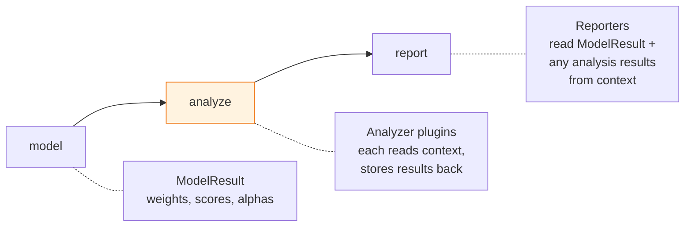
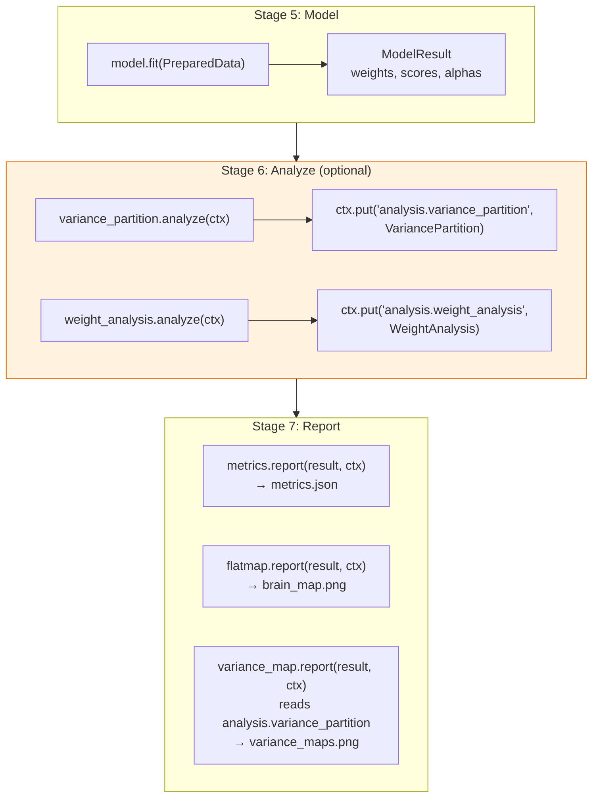

# Proposal: Postprocessing Analyze Stage

**Status:** Implemented

## The Problem

The current pipeline goes straight from model fitting to reporting:

```
stimuli → responses → features → preprocess → model → report
```

There's no place for computations that happen **after** fitting but **before** reporting — things like variance partitioning, weight decomposition, or feature importance analysis. These aren't reporters (they don't produce final artifacts), and they aren't models (they don't fit anything). They're a distinct class of operation that transforms or analyzes model outputs into derived results.

Today, if you want variance partitioning, you'd have to either:
- Cram it into a custom Reporter (wrong — reporters should render, not compute)
- Add it to the Model plugin (wrong — model fitting and analysis are independent concerns)
- Do it outside the pipeline in a notebook (loses the config-driven, reproducible workflow)

## The Proposal

Add a new **`analyze`** stage between `model` and `report`:

```
stimuli → responses → features → preprocess → model → analyze → report
```

Analyzers are a new plugin type. Each analyzer reads from the pipeline context (model weights, prepared data, features, etc.), computes derived results, and stores them back into context under their own key. Reporters — which already receive the full context — can then optionally pick up analysis results without any change to the Reporter protocol.



### Why this doesn't break anything

1. **Reporter protocol unchanged.** Reporters already receive `(result: ModelResult, context: PipelineContext, config: dict)`. They already have access to the full context. New reporters can check for analysis keys; existing reporters ignore them.

2. **Analyze stage is optional.** If no analyzers are configured, the stage is a no-op. Existing configs work unchanged.

3. **ModelResult stays frozen.** Analyzers don't mutate it. They produce new, separate data containers stored under their own context keys.

## Design

### Analyzer Protocol

```python
@runtime_checkable
class Analyzer(Protocol):
    """Computes derived results from model outputs."""
    name: str

    def analyze(self, context: PipelineContext, config: dict) -> None:
        """Read from context, compute results, store back into context.

        The analyzer is responsible for calling context.put() with its
        results. This allows analyzers to produce any output type —
        there is no single AnalysisResult container.
        """
        ...

    def validate_config(self, config: dict) -> list[str]: ...
```

**Key decision: `context` in, `context` out.** Unlike other plugins that have typed inputs and outputs (e.g. `Preprocessor.prepare(ResponseData, FeatureData) → PreparedData`), analyzers receive the full context and write back to it. This is intentional:

- Different analyzers need different inputs. Variance partitioning needs `PreparedData` + `ModelResult`. Weight analysis needs only `ModelResult`. A noise ceiling analyzer might need `ResponseData`.
- Different analyzers produce different outputs. There's no single `AnalysisResult` type that makes sense for all of them.
- The context already solves this — it's a typed key-value store.

### Data Containers

Each analyzer defines its own frozen dataclass. These are domain-specific, not a one-size-fits-all container:

```python
@dataclass(frozen=True)
class VariancePartition:
    """Per-voxel variance explained by each feature or feature group."""
    unique_variance: np.ndarray      # (n_groups, n_voxels)
    shared_variance: np.ndarray      # (n_voxels,)
    total_variance: np.ndarray       # (n_voxels,)
    group_names: list[str]
    metadata: dict[str, Any] = field(default_factory=dict)

@dataclass(frozen=True)
class WeightAnalysis:
    """Decomposed and summarized model weights."""
    per_feature_importance: np.ndarray   # (n_features, n_voxels)
    temporal_profiles: np.ndarray        # (n_features, n_delays, n_voxels)
    feature_names: list[str]
    delays: list[int]
    metadata: dict[str, Any] = field(default_factory=dict)
```

These live in `core/types.py` alongside the other data containers.

### Context Keys

Each analyzer stores its result under a namespaced key:

| Analyzer | Context Key | Type |
|----------|-------------|------|
| `variance_partition` | `analysis.variance_partition` | `VariancePartition` |
| `weight_analysis` | `analysis.weight_analysis` | `WeightAnalysis` |
| (future) `noise_ceiling` | `analysis.noise_ceiling` | `NoiseCeiling` |

The `analysis.` prefix keeps the context namespace clean and makes it obvious which keys come from the analyze stage.

### YAML Config

```yaml
# Optional — omit entirely to skip the stage
analysis:
  - name: variance_partition
    params:
      method: unique_r2          # or "shapley"
      groups:                     # optional feature groupings
        lexical: [numwords, numletters]
        semantic: [word2vec, bert]

  - name: weight_analysis
    params:
      normalize: true
```

Like preprocessing steps, each analyzer entry has a `name` and optional `params`. The list ordering determines execution order (some analyzers might depend on others).

### Orchestrator Changes

```python
ALL_STAGES = ['stimuli', 'responses', 'features', 'preprocess',
              'model', 'analyze', 'report']
```

New stage handler in `_run_stage`:

```python
elif stage_name == 'analyze':
    analysis_cfg = self.config.get('analysis', [])
    if not analysis_cfg:
        return "skipped (none configured)"
    for analyzer_cfg in analysis_cfg:
        analyzer = plugins['analyzers'][analyzer_cfg['name']]
        analyzer.analyze(self.ctx, self.config)
    return f"{len(analysis_cfg)} analyzer(s)"
```

The stage is a no-op when `analysis` is absent from config — no existing pipelines are affected.

### How Reporters Use Analysis Results

Existing reporters don't change. New reporters (or updated versions) can optionally consume analysis results:

```python
@reporter("variance_map")
class VarianceMapReporter:
    name = "variance_map"

    def report(self, result: ModelResult, context, config: dict):
        # Check if variance partitioning was run
        if not context.has('analysis.variance_partition'):
            return {}  # Nothing to report

        vp = context.get('analysis.variance_partition', VariancePartition)
        # Generate flatmaps per feature group...
```

This is the same pattern `flatmap.py` already uses to access `ResponseData` from context for surface/mask info — reporters reaching into context for extra data is an established pattern.

### Plugin Registration

Follows the same pattern as every other plugin type:

```python
# _decorators.py
_analyzers: dict[str, type] = {}
analyzer = _make_decorator(_analyzers)

# Usage
@analyzer("variance_partition")
class VariancePartitionAnalyzer:
    name = "variance_partition"
    ...
```

Registry gets `get_analyzer()`, `list_plugins()` includes `analyzers`, CLI `denizens list analyze` shows them.

## Pipeline Flow With Analyzers



## Example Analyzers

### Variance Partitioning

Measures unique variance explained by each feature (or feature group) by comparing full-model R² to leave-one-out R²:

```python
@analyzer("variance_partition")
class VariancePartitionAnalyzer:
    name = "variance_partition"

    def analyze(self, context, config):
        result = context.get('result', ModelResult)
        prepared = context.get('prepared', PreparedData)
        analysis_cfg = self._get_my_config(config)

        groups = analysis_cfg.get('groups')
        method = analysis_cfg.get('method', 'unique_r2')

        # Compute unique variance per feature/group
        # by comparing full R² to leave-one-out R²
        ...

        context.put('analysis.variance_partition', VariancePartition(
            unique_variance=unique_var,
            shared_variance=shared_var,
            total_variance=total_var,
            group_names=group_names,
        ))

    def validate_config(self, config):
        errors = []
        # Check that group feature names actually exist, etc.
        return errors
```

### Weight Analysis

Decomposes and summarizes the weight matrix:

```python
@analyzer("weight_analysis")
class WeightAnalysisAnalyzer:
    name = "weight_analysis"

    def analyze(self, context, config):
        result = context.get('result', ModelResult)

        # Reshape (n_delayed_features, n_voxels) →
        #   (n_features, n_delays, n_voxels)
        from denizenspipeline.core.array_utils import undelay_weights
        undelayed = undelay_weights(result.weights, result.delays)

        # Per-feature importance: sum of squared weights across delays
        per_feature = np.sqrt((undelayed ** 2).sum(axis=0))

        context.put('analysis.weight_analysis', WeightAnalysis(
            per_feature_importance=per_feature,
            temporal_profiles=undelayed,
            feature_names=result.feature_names,
            delays=result.delays,
        ))

    def validate_config(self, config):
        return []
```

## Implementation Steps

### 1. `core/types.py`
- Add `Analyzer` Protocol
- Add `VariancePartition` and `WeightAnalysis` dataclasses

### 2. `plugins/_decorators.py`
- Add `_analyzers` dict and `analyzer` decorator

### 3. `registry.py`
- Import `_analyzers`, add `self._analyzers`, getter, decorator
- Update `list_plugins()` and `_discover_entry_points()`

### 4. `orchestrator.py`
- Add `'analyze'` to `ALL_STAGES` (between `model` and `report`)
- Add `analyze` handler in `_run_stage`
- Resolve analyzers in `_resolve_plugins`
- Validate analyzers in `_validate_all`

### 5. `plugins/analyzers/`
- `__init__.py`
- `variance_partition.py`
- `weight_analysis.py`

### 6. `plugins/__init__.py`
- Import analyzer modules

### 7. `config/schema.py`
- Validate `analysis` as optional list of `{name, params?}` dicts

### 8. `cli.py` + `ui.py`
- Add `analyze` to stage descriptions and colors
- `denizens list analyze` shows available analyzers

## Files to Modify

- `denizenspipeline/core/types.py`
- `denizenspipeline/plugins/_decorators.py`
- `denizenspipeline/registry.py`
- `denizenspipeline/orchestrator.py`
- `denizenspipeline/plugins/__init__.py`
- `denizenspipeline/config/schema.py`
- `denizenspipeline/cli.py`
- `denizenspipeline/ui.py`

## Files to Create

- `denizenspipeline/plugins/analyzers/__init__.py`
- `denizenspipeline/plugins/analyzers/variance_partition.py`
- `denizenspipeline/plugins/analyzers/weight_analysis.py`

## Open Questions

1. **Should analyzers be allowed to depend on each other?** For example, a `temporal_generalization` analyzer might want to read `analysis.weight_analysis`. If yes, ordering in the config list matters. If no, they're all independent and could run in parallel.

2. **Should there be a `--skip-analysis` CLI flag?** Useful for quick iterations where you only care about model scores and don't want to wait for variance partitioning.

3. **Noise ceiling estimation** needs response data from multiple splits or repeated presentations. Does it fit the Analyzer pattern, or is it a separate concern? It could be an analyzer that reads `ResponseData` from context.
